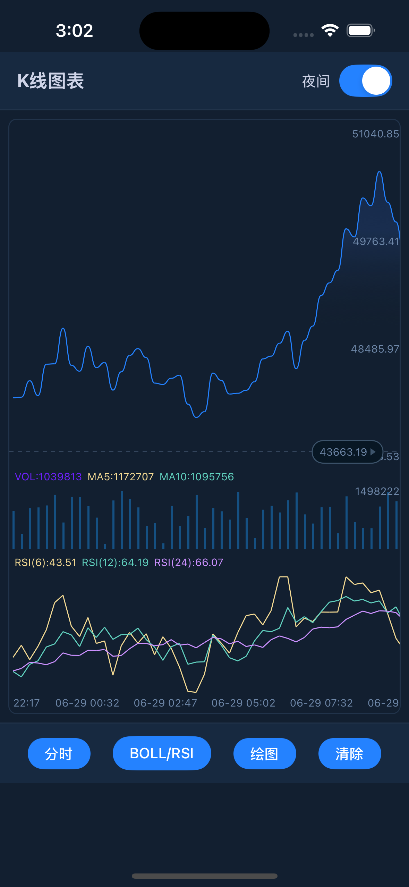

# @itsnyx/react-native-kline-chart

High-performance candlestick (K-Line) chart component for React Native with interactive drawing tools, technical indicators, and real-time data support.

[](https://www.npmjs.com/package/@itsnyx/react-native-kline-chart)
[](https://www.apache.org/licenses/LICENSE-2.0)
[](https://reactnative.dev)

<div align="center">
  
  
</div>
<div align="center">
  
</div>

## Features

- Native rendering on both iOS (Swift) and Android (Java) at 60fps
- Smooth pinch-to-zoom, scroll, and vertical price-axis zoom
- Long-press crosshair with animated info panel
- Real-time data updates via `modelArray` prop (WebSocket-friendly)
- Infinite scroll for loading historical candles (`onEndReached`)
- Technical indicators: MA, BOLL, MACD, KDJ, RSI, WR
- 15 drawing tools: trend lines, horizontal/vertical lines, rays, channels, rectangles, parallelograms, text annotations, price lines, time lines, candle markers, rulers, and more
- Drawing persistence: save and restore `drawItemList` across sessions
- Dark and light themes with full color customization
- Configurable candle width, padding, fonts, and layout ratios
- React Native New Architecture and Fabric compatible

## Installation

```bash
npm install @itsnyx/react-native-kline-chart
# or
yarn add @itsnyx/react-native-kline-chart
```

### iOS

```bash
cd ios && pod install
```

### Android

No additional setup required.

## Quick Start

```tsx
import RNKLineView from '@itsnyx/react-native-kline-chart';

const optionList = JSON.stringify({
  modelArray: candleData,
  shouldScrollToEnd: true,
  targetList: { /* indicator params */ },
  configList: { /* visual config */ },
  drawList: { drawType: 0 },
});

<RNKLineView
  style={{ flex: 1 }}
  optionList={optionList}
  onEndReached={() => { /* load older candles */ }}
  onDrawItemComplete={(e) => { /* save drawing */ }}
/>
```

For a complete working example with all features (theme switching, indicator controls, drawing toolbar, data processing), see [example/App.tsx](./example/App.tsx).

## Props

| Prop | Type | Required | Description |
|------|------|----------|-------------|
| `optionList` | `string` | Yes | JSON string with chart config, data, indicators, and drawings |
| `modelArray` | `string` | No | JSON string of data array only, for efficient real-time updates |
| `onDrawItemDidTouch` | `function` | No | Called when user touches an existing drawing |
| `onDrawItemComplete` | `function` | No | Called when a drawing is finished, returns full drawing object |
| `onDrawPointComplete` | `function` | No | Called when a drawing point is placed |
| `onEndReached` | `function` | No | Called when user scrolls to left edge (load more history) |
| `onNewOrder` | `function` | No | Called with the hovered price when user triggers a new order action |

## optionList Structure

```js
{
  modelArray: [...],          // candle data array
  shouldScrollToEnd: true,    // scroll to latest candle on load
  targetList: {...},          // indicator parameters
  configList: {...},          // visual/theme configuration
  drawList: {...},            // drawing tools configuration
}
```

### Data Format (modelArray items)

Each candle object should contain:

| Field | Type | Description |
|-------|------|-------------|
| `id` | `number` | Timestamp (ms) |
| `open` | `number` | Opening price |
| `high` | `number` | Highest price |
| `low` | `number` | Lowest price |
| `close` | `number` | Closing price |
| `vol` | `number` | Volume |

Additional computed fields for indicators (`maList`, `bollMb`, `bollUp`, `bollDn`, `macdValue`, `macdDif`, `macdDea`, `kdjK`, `kdjD`, `kdjJ`, `rsiList`, `wrList`) and display fields (`dateString`, `selectedItemList`) should be pre-calculated before passing to the component. See [example/App.tsx](./example/App.tsx) for the full processing pipeline.

### configList

| Property | Type | Description |
|----------|------|-------------|
| `colorList` | `{ increaseColor, decreaseColor }` | Bull/bear candle colors (use `processColor()`) |
| `targetColorList` | `number[]` | Colors for indicator lines |
| `backgroundColor` | `number` | Chart background |
| `textColor` | `number` | Axis text color |
| `gridColor` | `number` | Grid line color |
| `mainFlex` | `number` | Main chart height ratio (0.6-0.85) |
| `volumeFlex` | `number` | Volume chart height ratio (0.15-0.25) |
| `showVolume` | `boolean` | Show/hide volume section |
| `itemWidth` | `number` | Total candle slot width |
| `candleWidth` | `number` | Candle body width |
| `fontFamily` | `string` | Font for all text |
| `paddingTop` / `paddingBottom` / `paddingRight` | `number` | Chart padding |

All color values should be passed through React Native's `processColor()`.

### targetList (Indicator Parameters)

| Parameter | Default | Description |
|-----------|---------|-------------|
| `maList` | `[{day:5}, {day:10}, {day:30}]` | MA periods |
| `bollN` / `bollP` | `"20"` / `"2"` | Bollinger Bands period and multiplier |
| `macdS` / `macdL` / `macdM` | `"12"` / `"26"` / `"9"` | MACD fast/slow/signal |
| `kdjN` / `kdjM1` / `kdjM2` | `"9"` / `"3"` / `"3"` | KDJ parameters |
| `rsiList` | `[{day:6}, {day:12}, {day:24}]` | RSI periods |
| `wrList` | `[{day:6}, {day:10}]` | Williams %R periods |

### drawList

| Property | Type | Description |
|----------|------|-------------|
| `drawType` | `number` | Active drawing tool (see Drawing Types below) |
| `drawItemList` | `array` | Previously saved drawings to restore |
| `drawShouldContinue` | `boolean` | Keep drawing mode active after completing one |
| `shouldClearDraw` | `boolean` | Clear all drawings |
| `shouldFixDraw` | `boolean` | Finalize current drawing |
| `drawColor` | `number` | Drawing stroke color |
| `drawLineHeight` | `number` | Drawing stroke width |

### Drawing Types

| Value | Tool |
|-------|------|
| `0` | None (disable drawing) |
| `1` | Trend line (segment) |
| `2` | Horizontal line |
| `3` | Vertical line |
| `4` | Ray |
| `5` | Channel (parallel lines) |
| `101` | Rectangle |
| `102` | Parallelogram |
| `201` | Text annotation |
| `301` | Global price line |
| `302` | Global time line |
| `303` | Price line with labels |
| `304` | Candle marker |
| `305` | Right horizontal line with label |
| `306` | Ruler |

## Real-time Updates

For streaming data (WebSocket, polling), update only the data without re-sending the full config:

```tsx
<RNKLineView
  optionList={initialConfig}    // set once
  modelArray={JSON.stringify(liveData)}  // update on each tick
/>
```

## Infinite Scroll

```tsx
<RNKLineView
  onEndReached={() => {
    // fetch older candles, prepend to your data array,
    // and update modelArray — scroll position is preserved
  }}
/>
```

## Drawing Persistence

`onDrawItemComplete` returns a full drawing object you can serialize:

```js
{
  index, drawType, drawColor, drawLineHeight,
  drawDashWidth, drawDashSpace, drawIsLock,
  pointList: [{ x, y }],
  // text-only fields:
  text, textColor, textBackgroundColor, textCornerRadius,
}
```

Pass saved drawings back via `drawList.drawItemList` to restore them.

## Acknowledgments

This project is a fork of [react-native-kline-view](https://github.com/hellohublot/react-native-kline-view) by [@hellohublot](https://github.com/hellohublot), which itself was inspired by [KChartView](https://github.com/tifezh/KChartView) by [@tifezh](https://github.com/tifezh).

The upstream project is no longer actively maintained. This fork includes significant additions and fixes:

- Additional drawing tools (price lines, time lines, candle markers, rulers, text annotations with background/border-radius)
- Drawing lock support (`drawIsLock`)
- Scroll position preservation when prepending historical data
- Dynamic date formatting based on timeframe
- Hover panel improvements (volume formatting, border removal)
- Right price label coloring based on candle direction
- Vertical zoom gesture fixes on Android
- iOS/Android scroll interference fixes
- Various stability and performance improvements

## License

Apache License 2.0 - see [LICENSE](./LICENSE).
